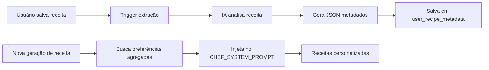

# Plano: Sistema de Memória Evolutiva

## Contexto
O projeto Já Comprei utiliza IA (Groq Llama 3.3) para gerar receitas. Atualmente, cada geração é independente, sem memória das preferências do usuário. Esta feature adiciona um loop de personalização.

---

## Arquitetura Proposta

### Fluxo de Dados


---

## 1. Schema de Metadados (JSON)

```json
{
  "proteina_principal": "frango" | "carne_bovina" | "peixe" | "porco" | "ovos" | "vegetariano" | "misto",
  "metodo_cocao": ["grelhar", "assar", "fritar", "cozinhar", "refogar", "cru"],
  "perfil_sabor": ["salgado", "doce", "picante", "acido", "umami"],
  "nivel_dificuldade": "facil" | "medio" | "dificil",
  "tempo_estimado_minutos": 30,
  "tipo_refeicao": "cafe_manha" | "almoco" | "jantar" | "lanche" | "sobremesa",
  "utensilios_especiais": ["forno", "panela_pressao", "frigideira", "liquidificador"],
  "ingredientes_chave": ["tomate", "cebola", "alho"],
  
  "restricoes_detectadas": ["sem_gluten", "sem_lactose", "vegano", "vegetariano", "baixo_sodio"] | null,
  "custo_estimado": "baixo" | "medio" | "alto",
  "ocasiao": "dia_a_dia" | "especial" | "festa",
  "num_ingredientes": 8
}
```

---

## 2. Prompt de Extração de Metadados

```text
Você é um Analista Culinário de IA. Analise a receita abaixo e extraia metadados estruturados.

**REGRAS:**
1. Identifique a proteína PRINCIPAL (a mais relevante, não listagens completas)
2. Liste os métodos de cocção UTILIZADOS (verbos de preparo observados)
3. Classifique o perfil de sabor dominante
4. Estime a dificuldade técnica (facil/medio/dificil)
5. Calcule o tempo médio baseado nos passos
6. Classifique o tipo de refeição mais adequado
7. Liste utensílios especiais (além de faca/panela básica)
8. Extraia os 3-5 ingredientes mais marcantes
9. DETECTE restrições alimentares implícitas (sem_gluten, sem_lactose, vegano, vegetariano, baixo_sodio) ou null se não houver
10. ESTIME o custo relativo (baixo/medio/alto) baseado nos ingredientes
11. CLASSIFIQUE a ocasião (dia_a_dia, especial, festa) pelo nível de elaboração
12. CONTE o número total de ingredientes na receita

**Receita:**
{recipe_json}

**RETORNE APENAS JSON PURO no formato especificado.**
```

---

## 3. Meta-Prompt de Reinjeção

Seção a ser adicionada dinamicamente no `CHEF_SYSTEM_PROMPT`:

```text
## PREFERÊNCIAS DO USUÁRIO (Memória Evolutiva)
Com base no histórico de {total_receitas} receitas salvas, este usuário demonstra:

**Proteínas Favoritas:** {lista_proteinas_ordenada}
**Métodos de Preparo Preferidos:** {lista_metodos_ordenada}
**Perfil de Sabor:** {perfil_dominante}
**Nível de Complexidade Preferido:** {nivel_medio}
**Horário de Cozinha:** {tipo_refeicao_mais_comum}

**DIRETRIZ:** Priorize receitas que utilizem as proteínas e métodos acima.
Para variedade, inclua 1 receita fora do padrão habitual marcada como "Descubra Algo Novo".
```

---

## Checklist de Implementação

### Backend
- [x] Criar tabela `user_recipe_metadata` no Supabase
- [x] Criar schema Pydantic `RecipeMetadata` em `schemas.py`
- [x] Criar serviço `metadata_extractor.py` com prompt de extração
- [x] Criar endpoint `/api/recipes/{recipe_id}/extract-metadata`
- [x] Criar função `get_user_preferences_summary(user_id)` que agrega dados
- [x] Modificar `groq_service.py` para injetar preferências no prompt

### Frontend
- [x] Modificar `saveRecipeToSupabase()` para chamar extração após save
- [x] (Opcional) Adicionar indicador visual de "Receita Analisada"

### Supabase
- [x] Criar tabela `user_recipe_metadata`
- [x] Criar RPC `get_aggregated_preferences` para eficiência (Integrado via Python)

---

## Verificação

### Teste Funcional
1. Salvar 3 receitas com proteínas diferentes
2. Verificar se metadados foram extraídos (query na tabela)
3. Gerar nova receita e verificar se prompt contém preferências

### Validação Manual
- Usuário que salva muitas receitas de frango deve receber mais sugestões de frango
- O sistema deve manter pelo menos 1 sugestão "fora da caixa"
