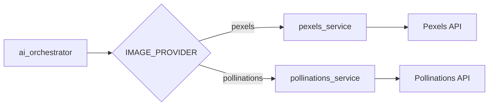

# Integração Pexels API para Thumbnails de Receitas

## Objetivo
Implementar busca de imagens no Pexels como alternativa ao Pollinations para thumbnails de receitas. A solução deve ser **reversível** para permitir voltar ao Pollinations caso necessário.

---

## User Review Required

> [!IMPORTANT]
> **Chave da API Pexels necessária.** É preciso criar/adicionar a variável `PEXELS_API_KEY` no arquivo `.env` do backend. A chave pode ser obtida em https://www.pexels.com/api.

> [!CAUTION]
> **Limite de uso do Pexels:** A API gratuita permite 200 requisições/hora e 20.000/mês. Monitore o uso em produção.

---

## Arquitetura da Solução



A estratégia usa uma **variável de ambiente** (`IMAGE_PROVIDER`) para alternar entre providers sem modificar código.

---

## Proposed Changes

### 1. Core Configuration

#### [MODIFY] [config.py](file:///c:/Users/emanu/Documents/Projetos/Já comprei/backend-ja-comprei/app/core/config.py)

- Adicionar campo `PEXELS_API_KEY: str | None = None` para autenticação
- Adicionar campo `IMAGE_PROVIDER: str = "pexels"` com opções: `"pexels"` | `"pollinations"`

---

### 2. Pexels Service (Novo)

#### [NEW] [pexels_service.py](file:///c:/Users/emanu/Documents/Projetos/Já comprei/backend-ja-comprei/app/services/pexels_service.py)

Criar serviço dedicado com:

```python
class PexelsService:
    BASE_URL = "https://api.pexels.com/v1"
    
    async def search_photo(self, query: str, orientation: str = "landscape") -> dict | None:
        """
        Busca uma foto no Pexels baseada no nome do prato.
        
        Returns:
            dict com: image_url (medium), image_url_large (large2x), photographer, pexels_url
            None se nenhum resultado encontrado
        """
        
    def get_search_query(self, dish_name: str) -> str:
        """
        Converte nome do prato em query otimizada para busca.
        Ex: "Arroz de Brócolis com Frango" -> "broccoli rice chicken dish"
        """
```

**Parâmetros da busca:**
- `orientation=landscape` - melhor para thumbnails no formato atual
- `per_page=1` - apenas a primeira foto (mais relevante)
- `locale=pt-BR` - para resultados mais contextuais

---

### 3. AI Orchestrator (Modificar)

#### [MODIFY] [ai_orchestrator.py](file:///c:/Users/emanu/Documents/Projetos/Já comprei/backend-ja-comprei/app/services/ai_orchestrator.py)

**Mudanças:**

1. Importar ambos serviços (pexels e pollinations)
2. Checar `settings.IMAGE_PROVIDER` para decidir qual usar
3. **Comentar** a lógica do Pollinations (manter código existente)
4. Adicionar lógica assíncrona para Pexels

```python
# ANTES (comentar):
# image_url = pollinations_service.get_image_url(full_prompt)

# DEPOIS:
if settings.IMAGE_PROVIDER == "pexels":
    result = await pexels_service.search_photo(recipe.get("nome_do_prato", ""))
    image_url = result["image_url"] if result else None
else:  # pollinations
    image_url = pollinations_service.get_image_url(full_prompt)
```

---

### 4. Documentação

#### [MODIFY] [tech-stack.md](file:///c:/Users/emanu/Documents/Projetos/Já comprei/.conductor/tech-stack.md)

Adicionar `Pexels API (Image Search)` à seção Backend.

---

## Benefícios vs Trade-offs

| Aspecto | Pexels | Pollinations |
|---------|--------|--------------|
| **Relevância** | Alta (fotos reais de pratos) | Variável (depende do prompt) |
| **Consistência** | Alta (banco curado) | Baixa (IA generativa) |
| **Velocidade** | Rápida (busca simples) | Lenta (geração de imagem) |
| **Atribuição** | Requer crédito ao Pexels | Não requer |
| **Limite** | 200/hora, 20k/mês | Sem limite claro |

---

## Verification Plan

### Automated Tests

**Comando para testar manualmente o serviço:**

```bash
cd backend-ja-comprei
python -c "
import asyncio
from app.services.pexels_service import pexels_service

async def test():
    result = await pexels_service.search_photo('arroz com frango')
    print(result)

asyncio.run(test())
"
```

### Manual Verification

1. **Configurar `.env`:**
   - Adicionar `PEXELS_API_KEY=sua_chave_aqui`
   - Adicionar `IMAGE_PROVIDER=pexels`

2. **Testar fluxo completo:**
   - Iniciar o backend: `uvicorn app.main:app --reload`
   - Usar o Scanner para processar uma lista de ingredientes
   - Verificar se as receitas geradas têm thumbnails de fotos do Pexels

3. **Testar fallback para Pollinations:**
   - Mudar `.env` para `IMAGE_PROVIDER=pollinations`
   - Reiniciar o servidor
   - Verificar que as imagens voltam a ser geradas pelo Pollinations

---

## Checklist

- [ ] Adicionar configurações no `config.py`
- [ ] Criar `pexels_service.py`
- [ ] Modificar `ai_orchestrator.py` (manter Pollinations comentado)
- [ ] Atualizar `tech-stack.md`
- [ ] Testar busca isolada do Pexels
- [ ] Testar fluxo completo de receitas
- [ ] Testar alternância entre providers
