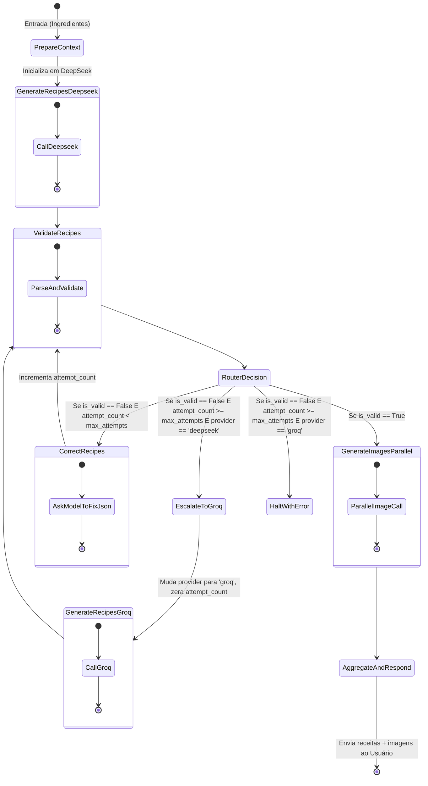

# Plano de Implementação: Arquitetura de Receitas Resiliente com LangGraph

Este plano detalha a reestruturação do fluxo de geração de receitas do projeto **Já Comprei**. A arquitetura atual de um único passo com fallback síncrono simples será substituída por um fluxo de estados dinâmico baseado em **LangGraph**, com auto-correção de JSON, roteamento de fallbacks em cadeia, receitas focadas em criatividade gourmet e geração de imagens paralela via OpenRouter (primário) e Gemini (fallback).

---

## 1. Motivação e Objetivos

Atualmente, se um provedor de IA (como o DeepSeek) falha ou envia um JSON malformado que não passa na validação Pydantic, o sistema faz um chaveamento síncrono único de fallback para o Groq. Se o Groq também retornar uma estrutura incompleta, a resposta falha ou entrega dados quebrados para o usuário.

Além disso, a latência de imagem atual do Pollinations AI (~15s) degrada a UX. Migrar para o OpenRouter (pago/rápido) com fallback para o Gemini (free/rápido) trará estabilidade e velocidade (geração ≤ 3s), mantendo o Pollinations como último recurso (terciário).

**Objetivos da nova arquitetura:**
1.  **Auto-Correção (Reflexion)**: Se o LLM gerar um JSON inválido, o sistema não desiste imediatamente. Ele envia os erros de validação de volta para o modelo em um ciclo de correção (de até 3 tentativas).
2.  **Criação Gourmet e Inovadora**: Elevar a criatividade do prompt do Chef e subir a temperatura das chamadas para `0.85` para gerar pratos autorais, fusions e harmonizações sofisticadas de sabores.
3.  **Paralelização Assíncrona & Roteamento de Imagens**: Gerar as imagens estilo Studio Ghibli em paralelo para todas as receitas geradas, utilizando a cadeia OpenRouter (Flux/Seedream) ➔ Gemini (base64) ➔ Pollinations (Flux).
4.  **Resiliência Total**: Se o modelo primário (DeepSeek) falhar repetidamente nos ciclos de correção, o grafo transiciona automaticamente para o provedor secundário (Groq), reiniciando o ciclo de validação de forma independente.

---

## 2. Pré-condições
- [ ] `OPENROUTER_API_KEY` configurada no arquivo `.env` para produção/homologação.
- [ ] `GEMINI_API_KEY` configurada e ativa (existente, usada como fallback de imagem).
- [ ] `DEEPSEEK_API_KEY` configurada no arquivo `.env` (primário de receitas).
- [ ] `GROQ_API_KEY` configurada e ativa (fallback de receitas).
- [ ] Python ≥ 3.12 instalado localmente e no ambiente de produção.

---

## 3. Requisitos e Métricas

### Funcionais
- **REQ-01 (Sanitização & Contexto)**: Limpar inputs contra *prompt injection* e consolidar o histórico RAG do usuário em um nó isolado (`PrepareContext`).
- **REQ-02 (Roteamento de Modelos)**: Enviar requisições primariamente para o `deepseek-v4-flash` com temperatura elevada (`0.85`) para receitas criativas, acionando fallback em cadeia para o Groq (`openai/gpt-oss-120b` ➔ `openai/gpt-oss-20b`) conforme SPEC-002.
- **REQ-03 (Auto-Correção/Reflexion)**: Detectar erros de schema Pydantic e reenviar o JSON defeituoso acompanhado do relatório de erros para correção automática do LLM ativo.
- **REQ-04 (Paralelização & Cadeia de Imagens)**: Disparar requisições concorrentes de imagem usando concorrência local assíncrona.
- **REQ-05 (Roteamento de Imagens)**: Adotar a seguinte cadeia de orquestração de imagens:
  1. **Primário**: OpenRouter Image API (`bytedance-seed/seedream-4.5` ou similar rápido).
  2. **Secundário (Fallback)**: Google Gemini Image API (base64 via `generateContent`).
  3. **Terciário (Último Recurso)**: Pollinations AI (URL estática Flux).

### Não-Funcionais
- **NFR-01 (Latência)**: O tempo total de geração do conjunto completo de imagens em paralelo (OpenRouter ou Gemini) deve ser ≤ 3.0s.
- **NFR-02 (Confiabilidade)**: A taxa de falha de estruturação das receitas entregues na resposta final do endpoint deve ser inferior a 1% em teste de carga com 100 requisições consecutivas.
- **NFR-03 (Observabilidade)**: Cada nó do grafo deve emitir métrica estruturada de tempo de execução e status (`success`/`failure`) para o sistema de logging centralizado.

---

## 4. Performance Baseline (Implementação Atual)
- **Geração de receita (sequencial)**: média 3.2s, P95 5.8s
- **Geração de 5 imagens (sequencial)**: média 12.4s, P95 18.2s
- **End-to-end completo**: média 15.6s, P95 24.0s

**Target pós-LangGraph & OpenRouter**:
- **Geração de receita (com reflexão)**: média ≤ 4.0s
- **Geração de 5 imagens (paralelo OpenRouter/Gemini)**: média ≤ 3.0s (speedup de 4x)
- **End-to-end completo**: média ≤ 7.0s (speedup estimado de ≥ 2.2x)

---

## 5. Critérios de Aceite
- **AC-01a**: Após auto-correção, o JSON de receitas deve validar com sucesso contra o schema Pydantic com 100% dos campos obrigatórios preenchidos.
- **AC-01b**: A taxa de sucesso de correção automática de JSONs intencionalmente malformados deve ser ≥ 95% em uma suíte com 100 amostras simuladas.
- **AC-02**: Imagens de todas as receitas sugeridas devem ser geradas em paralelo usando `asyncio.gather`, com speedup mínimo de 2.5x em relação à implementação sequencial atual, medido sobre 10 requisições de 5 receitas cada.
- **AC-03**: A integração de fallback deve transicionar do DeepSeek para o Groq após 3 falhas consecutivas de validação Pydantic (ValidationError) OU 5 timeouts de requisição consecutivos (>30s cada), com período de cooldown de 60s antes de tentar retornar ao modelo primário.
- **AC-04**: Após o esgotamento total de fallbacks (falha de todos os LLMs ou APIs de imagem), o endpoint deve retornar HTTP 503 com mensagem amigável de indisponibilidade, sem crashar o serviço.

---

## 6. Nova Arquitetura de Estados (StateGraph)

O fluxo de IA será estruturado como uma máquina de estados finitos utilizando a biblioteca `langgraph`.

### 6.1 Esquema do Estado (`RecipeState`)

```python
from typing import List, Dict, Any, Optional
from pydantic import BaseModel, Field

class RecipeState(BaseModel):
    # Entradas
    ingredients: List[str]
    user_id: Optional[str] = None
    
    # Contexto acumulado
    user_preferences: Optional[str] = None
    recipe_count: int = 0
    recipe_context: str = ""
    
    # Resposta intermediária do LLM
    raw_response: Optional[str] = None
    recipes_data: Optional[Dict[str, Any]] = None # Armazena receitas parseadas/validadas
    
    # Controle de fluxo e resiliência
    is_valid: bool = False
    validation_errors: List[str] = Field(default_factory=list)
    attempt_count: int = 0
    max_attempts: int = 3
    active_model: str = ""
    provider: str = "deepseek"  # "deepseek" | "groq"
    
    # Imagens associadas
    recipe_images: Dict[int, str] = Field(default_factory=dict) # index -> url_imagem (ou data URI)
```

### 6.2 Diagrama do Grafo de Decisão



---

## 7. Escopo e Limitações

### Dentro do escopo
- Modelagem do grafo de decisão de receitas (`StateGraph`) e integração de nós assíncronos.
- Configuração do modelo de estado (`RecipeState`).
- Substituição do código síncrono no roteador/orquestrador.
- Refatoração de prompts para culinária criativa brasileira contemporânea.
- Criação de `image_service.py` coordenando OpenRouter (primário), Gemini (fallback) e Pollinations (terciário).
- Async/await local via `asyncio` para paralelização de chamadas de imagem.

### Fora do escopo (v1)
- Lógica de backoff exponencial persistente com armazenamento em Redis.
- Filas de mensageria assíncronas externas (RabbitMQ, SQS, Kafka).
- Migração de outros fluxos (Scanner Vision, Transcrição de Voz) para o grafo.

---

## 8. Riscos e Mitigações

| Risco | Impacto | Mitigação |
|---|---|---|
| Aumento de custos por requisições extras no loop de reflexão | Baixo | Uso do DeepSeek V4 Flash (primário) que possui custo extremamente reduzido por token. |
| Overhead de tempo de execução nos loops de correção | Médio | Limite de tentativas fixado em 3; caso estoure, o sistema força a transição de provedor. |
| Curva de aprendizado e complexidade do LangGraph | Médio | Criar um spike técnico de prova de conceito antes da migração completa; estimar 40% de contingência. |
| Exaustão de limites de uso/cotas no OpenRouter | Médio | Fallback transparente para o Gemini Free Tier e posteriormente para o Pollinations AI. |

---

## 9. Dependências Técnicas

### Novas Bibliotecas (v1)
- `langgraph>=0.2.0` — orquestração de máquina de estados.
- `langchain>=0.3.0` — integração de fluxos LLM.
- `langchain-openai>=0.2.0` — cliente para o DeepSeek (OpenAI-compatible).
- `langchain-groq>=0.2.0` — cliente para integração com modelos Groq.

---

## 10. Rollback Plan (Em caso de falha em produção)
1. Reverter o arquivo `ai_orchestrator.py` para a versão anterior à integração do grafo (git tag `pre-langgraph-v1.0.0`).
2. Remover dependências `langgraph`, `langchain`, `langchain-openai` e `langchain-groq` do `requirements.txt`.
3. Reiniciar o serviço backend (tempo de recuperação estimado: 5 minutos).
4. Monitorar métricas de erro por 1 hora pós-rollback.

*Critério de acionamento do rollback*: Taxa de erro geral > 5% em janela de 15 minutos pós-deploy OU latência P95 > 10s.

---

## 11. Tasks Relacionadas
- **TASK-005-1**: Adicionar dependências (`langgraph`, `langchain`, `langchain-openai`, `langchain-groq`) no `requirements.txt` e verificar compatibilidade de runtime local/produção.
- **TASK-005-2**: Revisar e refatorar os prompts versionados ([chef_v1.py](file:///c:/Users/emanu/Documents/Projetos/Já comprei/backend-ja-comprei/app/prompts/chef_v1.py)) para aumentar o tom de criatividade gourmet, técnicas contemporâneas e instruções de empratamento requintado no `visual_tag`.
- **TASK-005-3**: Criar o serviço de imagem unificado `image_service.py` com a cadeia de fallback OpenRouter ➔ Gemini ➔ Pollinations AI.
- **TASK-005-4**: Criar o nó de orquestração estruturado em `recipe_graph.py`.
- **TASK-005-5**: Criar uma suíte de testes de simulação de falhas (JSON quebrado, timeout, HTTP 5xx) para validar auto-correção, paralelismo e fallbacks.
- **TASK-005-6**: Refatorar `ai_orchestrator.py` para invocar a máquina de estados do LangGraph.
- **TASK-005-7**: Criar documentação operacional contendo walkthrough técnico do grafo, guia de debugging de nós, guia de expansão/inserção de nós e métricas para monitoramento em produção.
